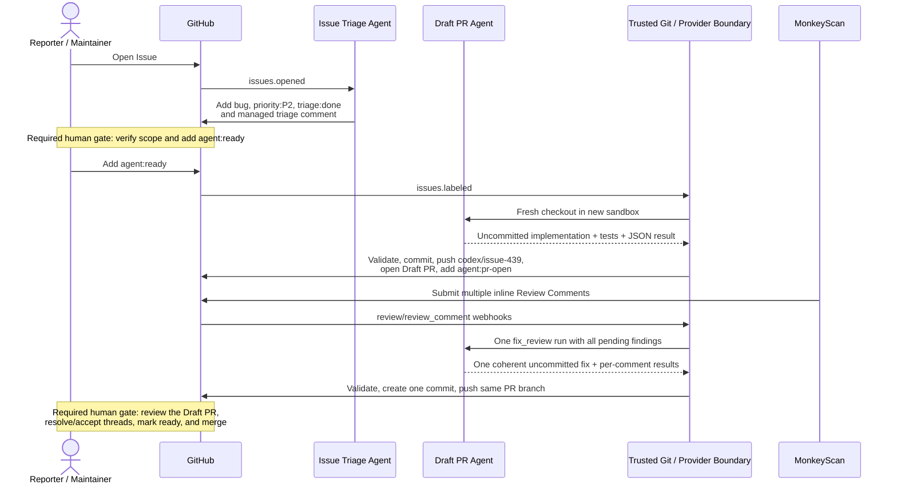

# engineering-agent-workflows

Versioned AI workflows for Issue triage and maintainer-approved repository
changes. Event ingestion stays thin; policy, validation, and provider writes live
in deterministic TypeScript boundaries.

## Workflows

### Issue Triage Agent

The Issue Triage Agent supports GitLab and GitHub. It:

1. receives an Issue or ordinary comment event;
2. loads current Issue context and duplicate candidates through the provider API;
3. asks the Agent for advisory classification facts;
4. validates the response and calculates priority in deterministic code; and
5. updates managed labels and one concise managed comment in apply mode.

It preserves the Issue title and unmanaged labels, never creates or manages
`area:*`, and never adds `agent:ready`. A configured skip label such as
`skip-triage` stops the workflow. For `labeled` and `unlabeled` events, only a
change to the skip label retriggers triage, preventing loops from `agent:*`
state transitions.

### Draft PR Agent

The Draft PR Agent is GitHub-only and currently allowlisted to
`chaitin/agent-compose`. A maintainer starts it by adding `agent:ready` to an
open Issue. The state flow is:

```text
agent:ready ──▶ agent:running ──┬──▶ agent:pr-open
                               ├──▶ agent:needs-approval
                               └──▶ agent:failed

agent:needs-approval + agent:approved ──▶ agent:running
```

The workflow:

1. verifies the Issue, labels, repository allowlist, and absence of an existing
   open PR or remote branch for `codex/issue-<number>`;
2. clones the default branch into a per-Issue shared workspace and claims the
   Issue in apply mode;
3. lets the Agent edit uncommitted files and run focused checks without provider
   credentials;
4. rejects stale Issue context, a moved or committed `HEAD`, empty or malformed
   diffs, reported failed tests, secret-like added lines, and policy-gated risk;
5. commits and pushes through the trusted outer Git boundary; and
6. creates a Draft Pull Request and records its URL on the Issue.

`agent:approved` reruns the implementation with approval for the previously
reported high-risk class; the temporary diff from the paused run is not
retained. The workflow only opens Draft PRs. It never merges, marks a PR ready,
closes an Issue, or rewrites Issue content.

The trusted Scheduler/tool owns `GITHUB_TOKEN`, Git authentication, the Issue
target binding, validation, and all GitHub writes. The Agent sees the prepared
Issue context and writable repository path, but its GitHub/GitLab token variables
are cleared. The Git remote remains credential-free HTTPS; the outer tool uses a
temporary `GIT_ASKPASS` boundary for clone and push.

Dry-run mode still clones the repository and lets the Agent produce and validate
a temporary local diff. It does not change labels, comments, branches, or Pull
Requests, and cleans the per-Issue workspace after evaluation.

### MonkeyScan review fixes

The same Draft PR Agent processes ordinary Conversation comments and inline
Review Comments posted by the configured MonkeyScan bot on an open
Agent-managed Draft PR. It does not reuse the Issue implementation sandbox.
Each attempt uses a new Agent sandbox and a fresh shallow clone of the current
`codex/issue-*` branch.

All unprocessed MonkeyScan comments visible on one PR are sorted by comment ID
and handled as one batch, producing at most one commit and one non-force push.
Inline findings include their file path, line location, diff hunk, and referenced
commit metadata. The deterministic tool verifies the bot login and optional
numeric user ID, the allowlisted head repository, Draft/open state, managed
branch prefix, comment fingerprint, and current head SHA. A per-PR lock prevents
concurrent pushes.

A managed PR comment stores separate Conversation and Review Comment cursors,
the current head SHA, and fix iteration count. Existing v1 Conversation cursors
remain readable. A one-minute Scheduler reconciliation finds comments whose
webhook overlapped another run. Automatic fixes stop after three batches or when
the diff crosses the existing approval gates. MonkeyScan comments are untrusted
findings: the Agent must verify each one against code and cannot edit, reply to,
or resolve scanner review threads.

### End-to-end example

Assume a reporter opens Issue `#439`: “Deletion recovery leaves `LastError`
set after the recovery has completed.” A normal run looks like this:



Concretely:

1. **Automatic triage:** the Issue Triage Agent verifies the Issue and proposes
   `bug`, `priority:P2`, and `triage:done`. Missing managed Labels are created
   before they are applied. It does not change the Issue title or add
   `agent:ready`.
2. **Human starts implementation:** a maintainer reviews the Issue scope and
   triage result, corrects any human-owned classification if necessary, and
   adds `agent:ready`. This is the mandatory authorization to modify code.
3. **Automatic Draft PR:** the Draft PR workflow claims the Issue with
   `agent:running`, checks out the default branch into an isolated workspace,
   implements and tests the change, validates the diff, pushes
   `codex/issue-439`, and opens a Draft PR. The Issue moves to `agent:pr-open`.
4. **Conditional human approval:** if implementation touches an approval-gated
   path or reports high risk, no PR is created. The Issue moves to
   `agent:needs-approval`; a maintainer must inspect the disclosed risk and add
   `agent:approved` before the Agent may rerun that scope.
5. **Automatic MonkeyScan batch:** MonkeyScan may publish several Conversation
   or inline Review Comments. The workflow collects pending MonkeyScan findings
   up to the configured batch limit (currently 50), sorts them deterministically,
   and gives them to one `fix_review` run. A valid result produces at most one
   commit and one push to the existing PR branch. Overflow or a comment that
   arrives after the batch snapshot is picked up by its webhook or the
   one-minute reconciliation pass.
6. **Conditional human scanner intervention:** automatic review fixes stop
   after three batches, on conflicting findings, on approval-gated risk, or
   when validation cannot establish a safe fix. A maintainer then decides
   whether to edit the PR, request another change, or accept the remaining
   finding. The Agent does not resolve MonkeyScan threads.
7. **Human finishes the PR:** a maintainer reviews the final diff and checks,
   resolves or accepts the review conversations, marks the Draft PR ready, and
   merges it under the repository's normal protection rules. These final PR
   actions are intentionally outside the Agent workflow.

Human intervention points are therefore: optional correction or `skip-triage`
during triage; required `agent:ready` before implementation; conditional
`agent:approved` for gated Issue implementation; conditional manual handling of
stopped MonkeyScan fixes; and required final PR review, readiness, and merge.

## Label ownership

The Issue Triage Agent uses the repository's existing type taxonomy:
`bug`, `enhancement`, `documentation`, and `question`. It emits `unknown` when
the Issue does not fit or lacks evidence; `unknown` never becomes a Label.

- If an Issue already has exactly one recognized type Label, that human-authored
  classification wins and the Agent does not add a conflicting type.
- If it has multiple recognized type Labels, triage reports the classification
  as unresolved and preserves all of them for maintainer resolution.
- If it has no type Label, a sufficiently confident analysis may add one.
- Only `priority:*` and `triage:*` are replaceable managed namespaces.
- `duplicate` may be added from a high-confidence candidate match but is never
  used to close the Issue.
- `invalid`, `wontfix`, `good first issue`, `help wanted`,
  `protobuf-breaking-approved`, all `agent:*`, and all `area:*` Labels are
  preserved and never managed by triage.
- `skip-triage` is a case-insensitive human control Label that stops the
  workflow before Agent analysis. Create it during repository setup; triage
  intentionally does not create control Labels automatically.

Descriptions and colors for automatically created classification, priority,
triage, and duplicate Labels are versioned in
`agents/issue-triage/policy.json`.

## Repository layout

```text
agents/issue-triage/     Issue Triage Skill, policy, and generated tool bundle
agents/draft-pr/         Draft PR Skill, policy, and generated tool bundle
loaders/                 Thin agent-compose Scheduler trigger scripts
src/issue-triage/        Deterministic triage validation and policy
src/draft-pr/            Draft PR policy, workspace, and orchestration
src/github/              GitHub REST boundary and payload types
src/gitlab/              GitLab API v4 boundary and payload types
src/issues/              Provider-neutral Issue boundary
examples/                GitLab and GitHub webhook fixtures
test/                    Network-free observable-behavior tests
```

`agent-compose.yml` references the loader files. The CLI snapshots them during
`agent-compose config/up`; they are not dynamically loaded by the daemon. Do not
edit generated files under `agents/*/scripts/` directly. Run `npm run build`
after changing `src/`.

The project `.env` configures Agent environments. Webhook sources and queue
settings belong to the daemon; project environment values do not configure the
daemon process.

## Requirements and permissions

- Node.js 20 or newer
- an agent-compose version supporting YAML `skills`, event schedulers, and bind
  volumes
- GitLab API v4 and/or GitHub API access to the target project
- a host directory at `./.draft-pr-workspaces` writable by the daemon and the
  Draft PR Agent sandbox

For Issue triage only, a GitHub App or fine-grained token needs:

- Metadata: read
- Issues: read and write

For the Draft PR workflow, it additionally needs:

- Contents: read and write
- Pull requests: read and write

A classic GitLab access token needs `api` scope. For GitLab, enable **Issues
events** and **Comments** and map them to `webhook.gitlab.issue` and
`webhook.gitlab.note`. For GitHub, enable **Issues**, **Issue comments**, **Pull
request reviews**, and **Pull request review comments**. Map them to
`webhook.github.issues`, `webhook.github.issue_comment`,
`webhook.github.pull_request_review`, and
`webhook.github.pull_request_review_comment`. Pull Request payloads delivered on
the Issues topic are ignored.

Webhook secrets authenticate inbound deliveries. `GITLAB_TOKEN` and
`GITHUB_TOKEN` are separate API credentials; never reuse a webhook secret as an
API token.

## Configuration

| Variable                      | Required                         | Purpose                                                            |
| ----------------------------- | -------------------------------- | ------------------------------------------------------------------ |
| `GITLAB_TOKEN`                | GitLab private/read or apply     | GitLab API authentication                                          |
| `GITLAB_API_URL`              | No                               | Defaults to `https://gitlab.com/api/v4`                            |
| `GITLAB_BOT_USERNAME`         | GitLab apply mode                | Owns the managed Note and prevents bot loops                       |
| `GITHUB_TOKEN`                | GitHub Draft PR or private/apply | GitHub API and outer Git authentication                            |
| `GITHUB_API_URL`              | No                               | Defaults to `https://api.github.com`                               |
| `GITHUB_SERVER_URL`           | No                               | Credential-free Git clone origin; defaults to `https://github.com` |
| `GITHUB_BOT_LOGIN`            | GitHub apply mode                | Owns managed comments and prevents bot loops                       |
| `GITHUB_ALLOWED_REPOSITORY`   | No                               | Optional Issue Triage allowlist                                    |
| `ISSUE_TRIAGE_MODEL`          | No                               | Issue Triage model override                                        |
| `ISSUE_TRIAGE_APPLY`          | No                               | `1` enables triage writes; defaults to `0`                         |
| `DRAFT_PR_MODEL`              | No                               | Draft PR model override                                            |
| `DRAFT_PR_APPLY`              | No                               | `1` enables claims, push, and Draft PR creation; defaults to `0`   |
| `DRAFT_PR_ALLOWED_REPOSITORY` | Yes                              | Exact Draft PR repository allowlist                                |
| `DRAFT_PR_GIT_AUTHOR_NAME`    | Apply mode                       | Deterministic commit author name                                   |
| `DRAFT_PR_GIT_AUTHOR_EMAIL`   | Apply mode                       | Deterministic commit author email                                  |
| `MONKEYSCAN_BOT_LOGIN`        | MonkeyScan review fixes          | Exact GitHub login allowed to trigger review fixes                 |
| `MONKEYSCAN_BOT_USER_ID`      | No                               | Optional numeric GitHub user ID for stronger identity matching     |

See `.env.example` for defaults. Model/provider credentials remain owned by
agent-compose and are not stored in this repository.

## Local verification

```bash
npm ci
npm run build
npm run check
agent-compose config --quiet
```

The deterministic tools can also be exercised independently. Commands remain
dry-run unless their corresponding apply variable is enabled:

```bash
GITLAB_TOKEN=... npm start -- \
  prepare --repository group/subgroup/project --issue 123

GITHUB_TOKEN=... npm run start:draft-pr -- \
  prepare --repository chaitin/agent-compose --issue 123 --trigger ready
```

Manual apply mode additionally requires matching
`ISSUE_TRIAGE_EXPECTED_REPOSITORY` / `ISSUE_TRIAGE_EXPECTED_ISSUE` or
`DRAFT_PR_EXPECTED_REPOSITORY` / `DRAFT_PR_EXPECTED_ISSUE` target bindings.

## Deployment and operations

1. Run `npm ci && npm run build && npm run check` from a reviewed revision.
2. Copy `.env.example` to `.env`, configure credentials, bot identity, and the
   exact Draft PR allowlist; leave both apply variables at `0`.
3. Create `./.draft-pr-workspaces` on storage shared by the trusted outer tool
   and Draft PR Agent. Do not expose this directory to unrelated workloads.
4. Configure authenticated GitLab and/or GitHub webhook sources.
5. Add the settings from `deploy/daemon.env.example` to the daemon environment.
   Both GitHub workflows share `webhook.github.issues`; each loader filters its
   own actions and labels. The example permits four concurrent GitHub Issue and
   comment deliveries; per-Issue and per-PR locks serialize the same target.
6. Run `agent-compose config --quiet`, then `agent-compose up`.
7. Send the fixtures under `examples/`, inspect dry-run results, then enable each
   apply variable independently.

Only one Draft PR run may hold an Issue workspace lock. Locks older than four
hours are treated as stale. A normal terminal result removes the workspace and
lock. If a process is killed, inspect the corresponding agent-compose run before
removing a stale lock or retrying.

If Git push succeeds but GitHub Draft PR creation fails, the remote
`codex/issue-<number>` branch is intentionally preserved and the Issue moves to
`agent:failed`. The workflow never force-pushes or deletes it. A maintainer must
inspect the branch, create the Draft PR manually or delete/rename the branch,
then retrigger with `agent:ready`.

## Priority policy

The triage model extracts facts; deterministic code chooses priority:

- `P0`: explicit critical security impact, data loss, or production outage
- `P1`: high security impact, release blocker, or blocked production core flow
  without a workaround
- `P2`: explicit broad/degraded impact, SLA risk, or blocked core flow
- `P3`: supported low-impact work
- `pending`: insufficient evidence or low confidence

Edit `agents/issue-triage/policy.json` and `agents/draft-pr/policy.json` to tune
managed labels and thresholds. Keep destructive operations outside these
workflows.
